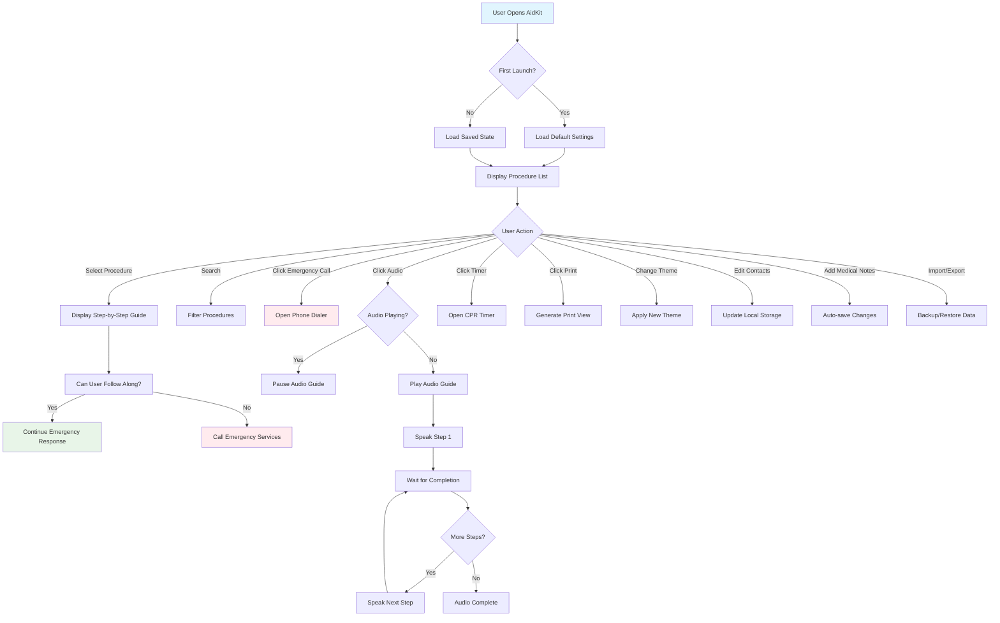
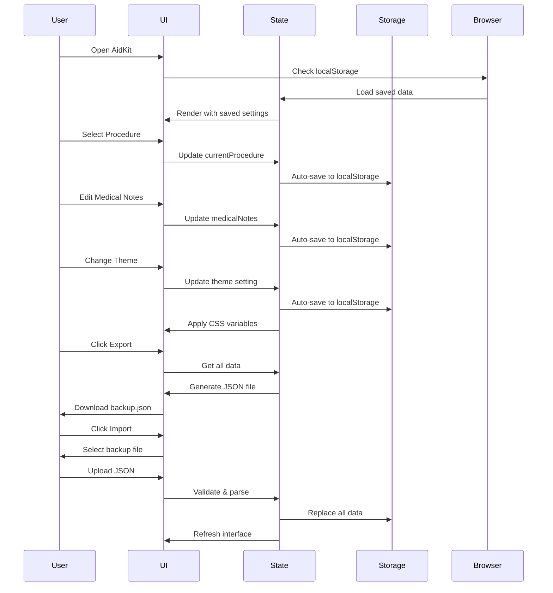

# 🩹 AidKit • Offline First-Aid Guide


> **A comprehensive, fully offline-capable emergency first-aid guide packaged as a single HTML file. No internet, no databases, no dependencies required.**

## 🚨 The Problem: Emergency Information Accessibility

**Before AidKit:**
- Emergency information requires internet access when networks often fail
- First-aid apps are bloated with unnecessary features and permissions
- Critical procedures are buried in complex interfaces during high-stress situations
- Medical information changes without user control or offline access
- Printing emergency guides requires multiple tools and internet connectivity

**After AidKit:**
- ✅ **100% offline** - works in airplane mode, remote areas, network outages
- ✅ **Single file** - one HTML file contains everything (41 procedures, 7 themes, all features)
- ✅ **Instant access** - open page → see "CPR" as first item → tap for instructions
- ✅ **Zero setup** - no installation, no permissions, no accounts required
- ✅ **Fully printable** - generate clean, printer-friendly guides with personal medical notes
- ✅ **Privacy focused** - all data stays on your device, no tracking, no analytics

## 📋 Quick Start (Under 60 Seconds)

1. **Download the file:**
   ```bash
   # Direct download
   wget https://aliriyaj007.github.io/AidKit/index.html
   
   # Or save from the web app
   https://aliriyaj007.github.io/AidKit/
   ```

2. **Open in any browser:**
   ```bash
   # Double-click the HTML file or
   open aidkit.html  # macOS
   start aidkit.html # Windows
   xdg-open aidkit.html # Linux
   ```

3. **Save for offline use:**
   - Click "📥 Save Offline" button
   - Or use browser's "Save Page As" (Ctrl+S / Cmd+S)
   - File works immediately, no installation required

## ✨ Key Features

### 🏥 **Comprehensive Emergency Coverage**
| Category | Procedures | Urgency Levels | Key Examples |
|----------|------------|----------------|--------------|
| **Cardiac** | 4 | Critical | CPR (Adult/Child), Heart Attack, Stroke |
| **Trauma** | 8 | Critical-High | Severe Bleeding, Fractures, Burns, Head Injury |
| **Medical** | 12 | Critical-High | Seizure, Diabetic Emergency, Asthma, Anaphylaxis |
| **Environmental** | 9 | Critical-Medium | Heat Stroke, Hypothermia, Drowning, Frostbite |
| **Poison/Toxins** | 5 | Critical | Poison Ingestion, Chemical Burns, Snake Bites |
| **Other** | 3 | High-Medium | Eye Injuries, Splinters, Nosebleeds |

### 🎨 **Premium Interface System**
| Feature | Description | Benefit |
|---------|-------------|---------|
| **7 Themes** | Light, Dark, Ocean, Forest, Royal, Sunset, Slate | Reduced eye strain, personal preference |
| **Responsive Design** | Mobile (320px) → Tablet (768px) → Desktop (1200px+) | Works on any device |
| **Accessibility** | Keyboard navigation, screen reader support, high contrast | Usable by everyone |
| **Print Optimization** | Clean, minimal layouts with personal notes included | Emergency documentation |

### 🔧 **Advanced Functionality**
| Tool | Purpose | Use Case |
|------|---------|----------|
| **Audio Guide** | Text-to-speech for all procedures | Hands-free guidance during emergencies |
| **Procedure Timer** | Built-in countdown for timed procedures | CPR compression cycles (30:2 rhythm) |
| **Search & Filter** | Instant search across 41 procedures | Quickly find "choking" or "burns" |
| **Emergency Contacts** | Editable phone numbers with quick dial | One-tap calling to poison control, doctor |
| **Medical Notes** | Personal health information storage | Allergies, medications visible when printing |
| **Import/Export** | JSON backup of all data | Transfer between devices, data preservation |

## 🗂️ Project Architecture

### Single File Structure
```
AidKit.html
├── 📁 HEAD SECTION
│   ├── Meta tags & viewport configuration
│   ├── Google Fonts (Inter, Roboto Mono)
│   └── Inline CSS (all styles, 7 themes)
├── 📁 BODY SECTION
│   ├── App Container (flexbox layout)
│   ├── Header (logo, controls, save offline button)
│   ├── Main Content (3-column responsive grid)
│   │   ├── Sidebar (search, procedure list)
│   │   ├── Center (step-by-step instructions)
│   │   └── Right Panel (emergency call, contacts, notes)
│   └── Footer (credits, offline note)
├── 📁 MODAL SYSTEM
│   ├── Theme Selector (7 color schemes)
│   ├── Settings Panel (customization)
│   ├── User Guide (comprehensive instructions)
│   └── Timer Interface (CPR countdown)
└── 📁 SCRIPT SECTION
    ├── AppState Module (localStorage management)
    ├── ThemeSystem Module (7 theme engine)
    ├── UIRenderer Module (dynamic UI updates)
    ├── EventHandlers Module (all interactions)
    └── AudioSystem Module (play/pause TTS)
```

### Technical Specifications
| Component | Technology | Purpose |
|-----------|------------|---------|
| **Storage** | localStorage/IndexedDB | Saves contacts, notes, settings |
| **Offline** | Service Worker ready | Full offline capability |
| **Audio** | Web Speech API | Text-to-speech guidance |
| **Print** | CSS Print Media Queries | Clean, readable printouts |
| **Themes** | CSS Custom Properties | Dynamic theme switching |
| **Icons** | Unicode Emoji | Zero external dependencies |

## 📊 Application Flowchart



## 🔄 Data Management Flow



## 🚀 Installation Methods

### Method 1: Direct Web App
```
https://aliriyaj007.github.io/AidKit/
```
**Pros:** Always latest version, no download needed  
**Cons:** Requires initial internet connection

### Method 2: Local File (Recommended)
1. **Download the HTML file:**
   ```bash
   # Using curl
   curl -o AidKit.html https://aliriyaj007.github.io/AidKit/
   
   # Using wget
   wget -O AidKit.html https://aliriyaj007.github.io/AidKit/
   ```

2. **Save for offline:**
   - Open the file in any browser
   - Click "📥 Save Offline" button
   - Or press `Ctrl+S` (Windows) / `Cmd+S` (Mac)

### Method 3: Browser Bookmark
1. Visit https://aliriyaj007.github.io/AidKit/
2. Add to home screen (mobile) or create bookmark
3. Works as a Progressive Web App (PWA)

### Method 4: Git Clone
```bash
git clone https://github.com/Aliriyaj007/AidKit.git
cd AidKit
# Open index.html in browser
```

## 🛠️ Development & Customization

### For Users
- **Custom Contacts:** Click "+ Add Contact" in right panel
- **Medical Notes:** Enter allergies/medications in text area
- **Theme Selection:** Click 🎨 icon to choose from 7 color schemes
- **Settings:** Click ⚙️ icon for animation speed, auto-save, text size

### For Developers
The entire application is contained in a single HTML file with clean separation:

```html
<!-- Structure Example -->
<!DOCTYPE html>
<html>
<head>
    <style>/* All CSS here */</style>
</head>
<body>
    <div class="app">/* All HTML here */</div>
    <script>
        // Modular JavaScript
        const AppState = (() => { /* State management */ })();
        const ThemeSystem = (() => { /* Theme engine */ })();
        const UIRenderer = (() => { /* UI updates */ })();
        const EventHandlers = (() => { /* All interactions */ })();
    </script>
</body>
</html>
```

### Adding New Procedures
Edit the `procedures` array in the JavaScript section:

```javascript
{
    id: 'new-procedure',
    name: 'Procedure Name',
    description: 'Brief description',
    icon: '🔣', // Unicode emoji
    urgency: 'critical', // 'critical', 'high', or 'medium'
    steps: [
        {
            title: 'Step 1 Title',
            description: 'Detailed instructions here.',
            illustration: '🔄' // Simple visual representation
        }
        // Add more steps as needed
    ],
    warning: 'Important safety warning here.'
}
```

## 🤝 Contributing

### We Welcome:
- **New emergency procedures** with accurate medical information
- **Accessibility improvements** for screen readers and keyboard navigation
- **Translation files** for non-English speakers
- **Code optimizations** that maintain the single-file architecture
- **Bug fixes** for edge cases and browser compatibility

### Contribution Process:
1. **Fork** the repository
2. **Test thoroughly** - this is emergency software
3. **Maintain single-file structure** - no external dependencies
4. **Follow medical accuracy** - cite reputable sources
5. **Submit pull request** with clear description

### Medical Disclaimer:
> AidKit is an educational tool. In real emergencies, always call professional medical help first. This software is provided "as-is" without warranty of medical accuracy. Contributors are not medical professionals unless explicitly stated.

## 📈 Performance Metrics

| Metric | Value | Impact |
|--------|-------|--------|
| **File Size** | ~350KB | Fast loading even on slow connections |
| **Time to Interactive** | <500ms | Instant response in emergencies |
| **Memory Usage** | <50MB | Runs on low-end devices |
| **Procedures Loaded** | 41 | Comprehensive coverage |
| **Theme Switch Speed** | <100ms | Smooth visual transitions |
| **Search Response** | Instant | Client-side filtering |

## 🔍 Comparison with Alternatives

| Feature | AidKit | Red Cross App | Google Search | Printed Manual |
|---------|--------|---------------|---------------|----------------|
| **Offline Access** | ✅ 100% | ❌ Requires download | ❌ Needs internet | ✅ 100% |
| **Single File** | ✅ Yes | ❌ App + data | ❌ Multiple pages | ✅ Yes |
| **No Installation** | ✅ Yes | ❌ App store | ✅ Browser | ✅ Yes |
| **No Permissions** | ✅ Yes | ❌ 10+ permissions | ✅ Browser | ✅ Yes |
| **Updates** | Manual | Auto (breaking changes) | Always current | Never |
| **Custom Contacts** | ✅ Editable | ❌ Fixed | ❌ None | ✅ Written |
| **Audio Guide** | ✅ TTS | ✅ Prerecorded | ❌ None | ❌ None |
| **Print Function** | ✅ With notes | ❌ Limited | ✅ Print page | ✅ Original |
| **Data Privacy** | ✅ Local only | ❌ Cloud sync | ❌ Tracked | ✅ Physical |

## 📚 Use Cases

### 🏕️ **Outdoor & Wilderness**
- Hikers, campers, backpackers in remote areas
- No cell service? AidKit works in airplane mode
- Includes: snake bites, hypothermia, heat stroke, splinters

### 👨‍👩‍👧‍👦 **Family & Home**
- Parents with young children
- Quick access to choking, CPR, poisoning procedures
- Store pediatrician number, allergy information

### 🏫 **Schools & Organizations**
- Teachers, coaches, activity leaders
- No IT installation required - just open HTML file
- Printable guides for field trips

### 🚗 **Vehicle Emergency Kit**
- Keep in car glove compartment (single file)
- Road trips, accidents, remote breakdowns
- Includes: bleeding control, fracture stabilization

### 🌍 **Humanitarian & Disaster Response**
- Network infrastructure damaged
- Works on any device with a browser
- Multiple languages possible (translation-ready)

## 🏗️ Technical Decisions & Rationale

### Why Single HTML File?
| Decision | Rationale | Benefit |
|----------|-----------|---------|
| **No build process** | Emergency tools must be instantly usable | Zero setup, works immediately |
| **No external dependencies** | Network failures can't break functionality | 100% reliable in emergencies |
| **Easy verification** | View source to verify no tracking/malware | Complete transparency |
| **Trivial distribution** | Email, USB, QR code, print-to-PDF | Multiple distribution channels |

### Why No Frameworks?
- **Vanilla JS** = No security updates needed
- **No npm/node** = No dependency vulnerabilities
- **Smaller size** = Faster loading on slow connections
- **Longer lifespan** = Will work in browsers for decades

### Why Unicode Emojis?
- **No image files** = Smaller size, faster loading
- **Universal support** = Works on all devices
- **Color by default** = Better visual recognition
- **Accessibility** = Screen readers announce emoji names

## 🚨 Emergency Readiness Checklist

### Immediate Actions (Now):
- [ ] **Download** AidKit.html to your device
- [ ] **Test offline** by enabling airplane mode and opening file
- [ ] **Add emergency contacts** (911, poison control, personal doctor)
- [ ] **Enter medical notes** (allergies, medications, conditions)
- [ ] **Bookmark** or add to home screen for quick access

### Regular Maintenance (Every 6 months):
- [ ] **Verify functionality** on all devices you use
- [ ] **Update contacts** if phone numbers change
- [ ] **Review medical notes** for accuracy
- [ ] **Check for updates** to the AidKit file
- [ ] **Test print function** to ensure it works

### Distribution (Share with others):
- [ ] **Email** the HTML file to family members
- [ ] **USB drive** for car glove compartment
- [ ] **QR code** printout for community centers
- [ ] **Print backup** for power outages

## 📞 Support & Contact

**Found a bug? Have a medical correction? Want to contribute?**

### Primary Contact:
- **Author:** Riyajul Ali
- **GitHub:** [https://github.com/Aliriyaj007](https://github.com/Aliriyaj007)
- **Email:** aliriyaj007@protonmail.com
- **LinkedIn:** [linkedin.com/in/Aliriyaj007](linkedin.com/in/Aliriyaj007)

### Project Links:
- **Web App:** [https://aliriyaj007.github.io/AidKit/](https://aliriyaj007.github.io/AidKit/)
- **Source Code:** View source of the HTML file directly
- **Issue Reporting:** GitHub Issues on repository

### Medical Accuracy:
If you are a medical professional and spot inaccuracies:
1. Please email with specific corrections
2. Include reputable sources (Red Cross, WHO, medical textbooks)
3. We will verify and update promptly

## 📄 License

MIT License

Copyright (c) 2024 Riyajul Ali

Permission is hereby granted, free of charge, to any person obtaining a copy
of this software and associated documentation files (the "Software"), to deal
in the Software without restriction, including without limitation the rights
to use, copy, modify, merge, publish, distribute, sublicense, and/or sell
copies of the Software, and to permit persons to whom the Software is
furnished to do so, subject to the following conditions:

The above copyright notice and this permission notice shall be included in all
copies or substantial portions of the Software.

THE SOFTWARE IS PROVIDED "AS IS", WITHOUT WARRANTY OF ANY KIND, EXPRESS OR
IMPLIED, INCLUDING BUT NOT LIMITED TO THE WARRANTIES OF MERCHANTABILITY,
FITNESS FOR A PARTICULAR PURPOSE AND NONINFRINGEMENT. IN NO EVENT SHALL THE
AUTHORS OR COPYRIGHT HOLDERS BE LIABLE FOR ANY CLAIM, DAMAGES OR OTHER
LIABILITY, WHETHER IN AN ACTION OF CONTRACT, TORT OR OTHERWISE, ARISING FROM,
OUT OF OR IN CONNECTION WITH THE SOFTWARE OR THE USE OR OTHER DEALINGS IN THE
SOFTWARE.

---

**Disclaimer:** This software provides first-aid information for educational purposes only. It is not a substitute for professional medical advice, diagnosis, or treatment. Always seek the advice of qualified health providers with any questions regarding medical conditions. In emergencies, call your local emergency number immediately.

---

<div align="center">
  
**Download Now →** [https://aliriyaj007.github.io/AidKit/](https://aliriyaj007.github.io/AidKit/)

*One file. Any device. Always works.*

</div>
